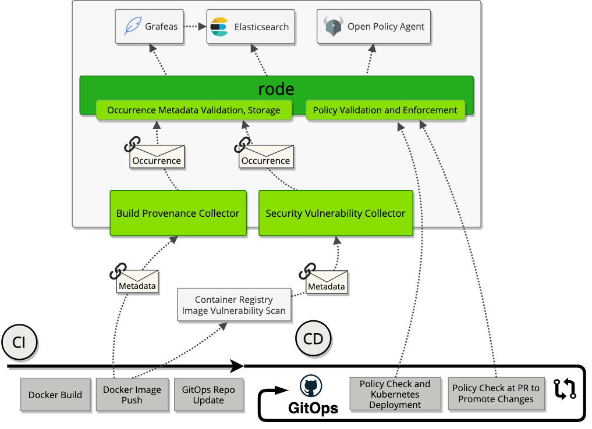

# Demo Application and CI Pipeline for Rode
This is the application repository used to demo Rode capabilities.
- The application used in the demo is a simple [Express/Node application](server.js) serving a `Hello World` response.
  - The application may be relatively basic, but we are able to show how something as simple as changing the base Docker image used to build the application may introduce undesired security vulnerabilities.
- We build this application Docker image via Kaniko from self-hosted Kubernetes GitHub Action runners.
- After the image is built successfully in the `main` branch, it is pushed to an internal Docker registry hosted in [Harbor](https://goharbor.io/) where it will be scanned for vulnerabilities and be made available to deploy to our Kubernetes cluster. We also create a "Build Occurrence" in Rode that will link any other occurrence detail with the artifact and git commit.
- Immediately after pushing to the Harbor registry, we notify our GitOps deployment repository by updating its deployment manifest with the new image version.
  - This stage is executed via our GitOps GitHub Action by making a commit to the [demo-app-deployment](https://github.com/rode/demo-app-deployment) repository.
  - The `dev` branch is updated in the destination repository, triggering a deployment via Helm to the respective `dev` environment Kubernetes namespace.

## Example Build and Deployment Workflow with Rode

